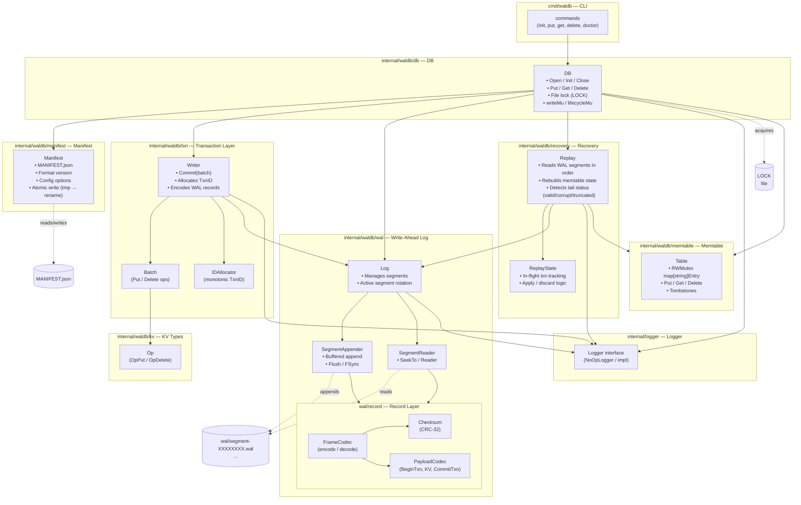

# WalDB

WalDB is a key-value store built on top of a write-ahead log (WAL). The repo provides a simple CLI for initializing and managing a WalDB instance. I also used this project as an opportunity to experiment with the role of AI in my learning process. I used ChatGPT to create the DESIGN.md document, which outlines the architecture and design decisions behind WalDB. I also had ChatGPT break the development work into GitHub issues, which I then implemented and committed to the repo. This approach allowed me to focus on writing code and learning by doing, while still benefiting from the guidance and structure provided by the design document and issue tracking.

## Goals

- Understand the design and implementation of a WAL-based key-value store.
- Practice writing Go code that interacts with the filesystem and handles errors gracefully.

## Architecture

See the [design document](https://github.com/julianstephens/waldb/blob/main/docs/DESIGN.md) for an in-depth overview of the architecture and design decisions behind WalDB. The codebase is organized into several packages:

- `internal/waldb`: Provides top-level DB initialization function.
- `internal/waldb/db`: Database management and operations.
- `internal/waldb/wal`: Write-ahead log management.
- `internal/waldb/manifest`: Manifest file management for user configuration and metadata.
- `internal/waldb/recovery`: Recovery logic for replaying the WAL and restoring DB state.
- `internal/waldb/txn`: Transaction management for batching operations and ensuring atomicity.
- `internal/waldb/memtable`: In-memory data structure for storing key-value pairs before flushing to disk.
- `internal/cli`: Command-line interface for interacting with WalDB.

