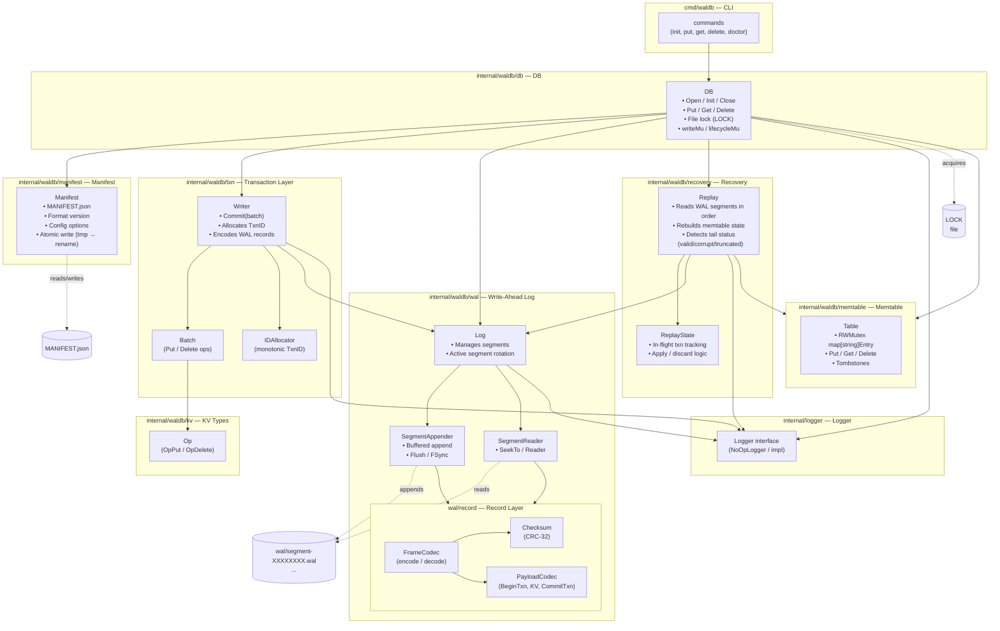

# WalDB

WalDB is a key-value store built on top of a write-ahead log (WAL). The repo provides a simple CLI for initializing and managing a WalDB instance. I also used this project as an opportunity to experiment with the role of AI in my learning process. I used ChatGPT to create the DESIGN.md document, which outlines the architecture and design decisions behind WalDB. I also had ChatGPT break the development work into GitHub issues, which I then implemented and committed to the repo. This approach allowed me to focus on writing code and learning by doing, while still benefiting from the guidance and structure provided by the design document and issue tracking.

## Goals

- Understand the design and implementation of a WAL-based key-value store.
- Practice writing Go code that interacts with the filesystem and handles errors gracefully.

## Architecture

See the [design document](https://github.com/julianstephens/waldb/blob/main/docs/DESIGN.md) for an in-depth overview of the architecture and design decisions behind WalDB. The codebase is organized into several packages:

- `internal/waldb`: Provides top-level DB initialization function.
- `internal/waldb/db`: Database management and operations.
- `internal/waldb/wal`: Write-ahead log management.
- `internal/waldb/manifest`: Manifest file management for user configuration and metadata.
- `internal/waldb/recovery`: Recovery logic for replaying the WAL and restoring DB state.
- `internal/waldb/txn`: Transaction management for batching operations and ensuring atomicity.
- `internal/waldb/memtable`: In-memory data structure for storing key-value pairs before flushing to disk.
- `internal/cli`: Command-line interface for interacting with WalDB.

## Key Workflows

### Initialization

When you run `waldb init`, the CLI will create the necessary directory structure for a WalDB instance, including the `wal/` directory for storing WAL segments and the `MANIFEST.json` file for configuration and metadata. It will also create a `LOCK` file to prevent multiple instances from accessing the same database concurrently.

### Put / Get / Delete

#### Put

CLI command: `waldb put <key> <value>`

Steps:

1. Transaction Creation: The CLI creates a new transaction batch and adds a Put operation with the specified key and value.
2. Transaction Commit: The transaction batch is committed, which involves:
   - Allocating a new TxnID.
   - Encoding the Put operation into a WAL record.
   - Appending the record to the active WAL segment using the SegmentAppender.
   - Flushing the segment to disk to ensure durability.
3. Memtable Update: The in-memory memtable is updated with the new key-value pair.

#### Get

CLI command: `waldb get <key>`

Steps:

1. Memtable Lookup: The CLI queries the memtable for the specified key.
2. Result Handling: If the key is found and not marked as deleted, the value is returned. If the key is marked as deleted (tombstone) or not found, an appropriate message is returned.

#### Delete

CLI command: `waldb delete <key>`

Steps:

1. Transaction Creation: A new transaction batch is created, and a Delete operation is added for the specified key.
2. Transaction Commit: Similar to the Put operation, the transaction batch is committed, which involves:
   - Allocating a new TxnID.
   - Encoding the Delete operation into a WAL record.
   - Appending the record to the active WAL segment and flushing it to disk.
3. Memtable Update: The memtable is updated to mark the key as deleted using a tombstone entry.

### Recovery

When the database is opened, the recovery process is triggered to ensure that the state of the database is consistent with the WAL. The recovery process involves:

1. WAL Replay: The recovery module reads all WAL segments in order, starting from the oldest to the newest. It decodes each record and applies the operations to an in-memory memtable.
2. In-flight Transaction Handling: The recovery process tracks in-flight transactions (those that have begun but not yet committed) and applies or discards their operations based on whether a corresponding commit record is found.
3. Tail Status Detection: The recovery process detects the status of the WAL tail, which can be valid, corrupt, or truncated. This information is crucial for determining the integrity of the database and whether any data loss may have occurred.
